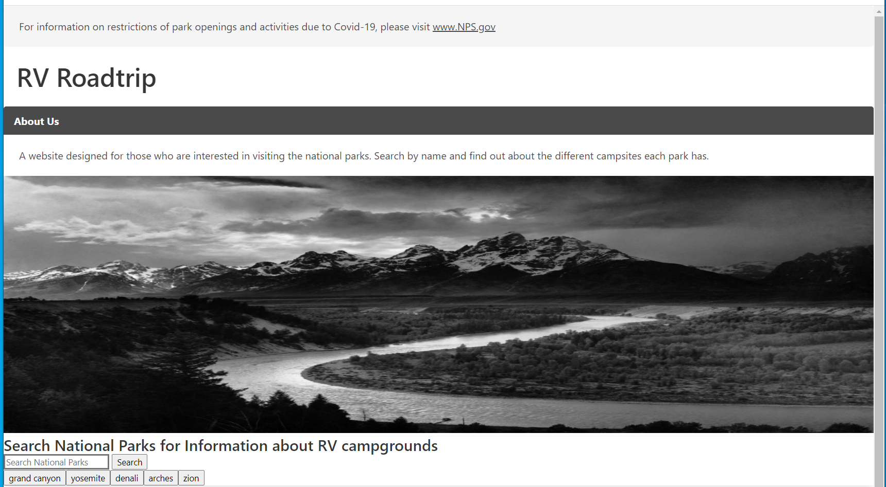
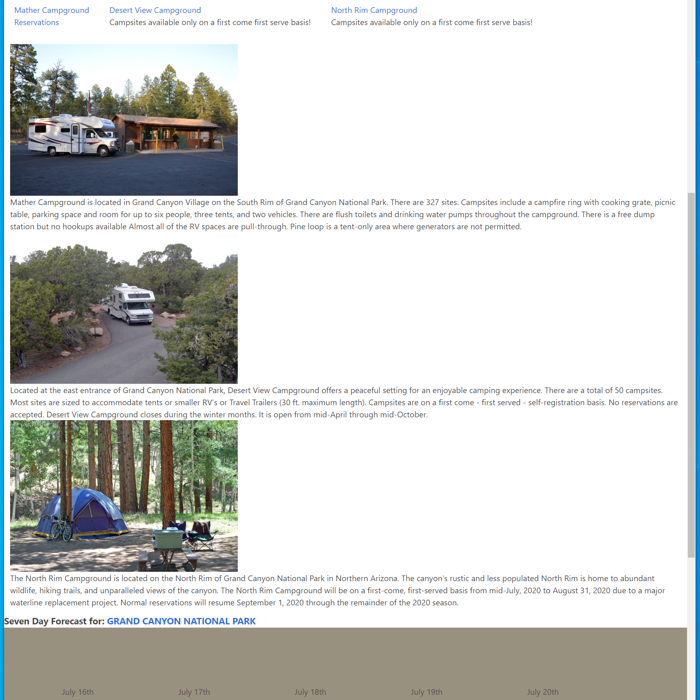
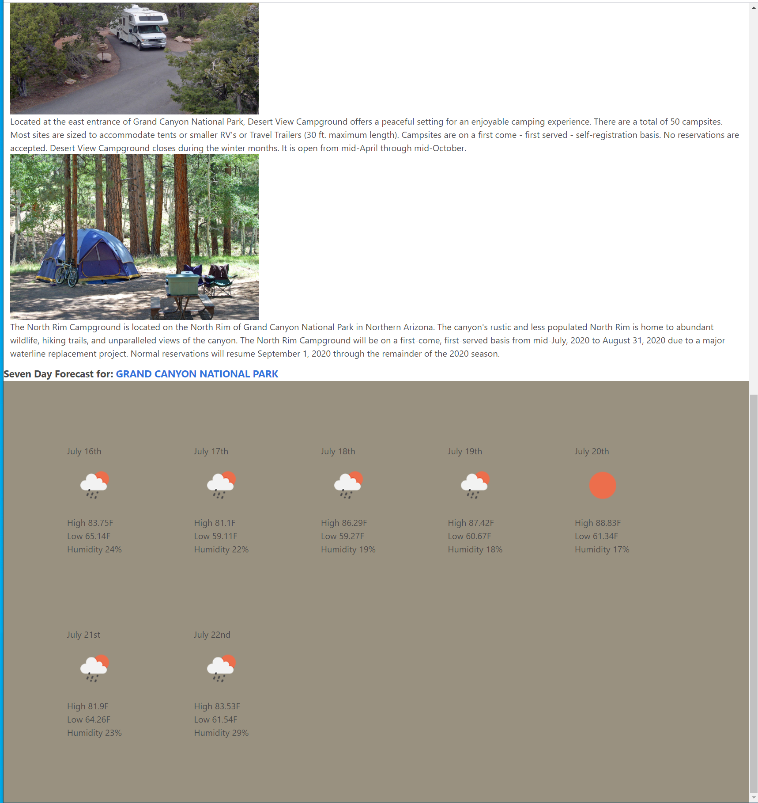

# RV Roadtrip

## User story
Pat is a recently retired Airline pilot, who decided to buy an RV so that he could travel the nation looking for clear and bright night skies.  He and his wife wanted to visit many of the National Parks in the US but needed information on which campsites would allow for RV’s.  He also wanted to know about the weather forecast since he wanted to indulge his new hobby of taking pictures of the stars and galaxies with his new telescope.  The goal of this website was to provide a means for Pat to get the information he needed about the National Parks to ensure that his RV Roadtrip would be a success.

### HTML-snippet
```
    <section id="search-parks-container" class="search-parks-form">

            <div class="section-search-title">
                <h3>Search National Parks for Information about RV campgrounds</h3>
            </div>
            <div class="search-parks">
                <input type="text" name="search-park" class="search-input" id="parkName" placeholder="Search National Parks">
                <button id="search-btn" class="search-bar" type="submit">Search</button>
            </div>
            <div id="parkName-btn">
            </div>
        </section>
```
### Javascript-snippet
```
    var getParkName = function() {
        //retrieve the parks saved in local storage
        var savedParkName = localStorage.getItem("parks");
        if (savedParkName) {
            savedParkName = JSON.parse(savedParkName);
            for (var i = 0; i < savedParkName.length; i++) {
                var parkNameId = savedParkName[i] + "btn";
                displayButton(savedParkName [i], parkNameId);
            }
        }
    }
    var displayButton = function(savedParkName, parkBtn) {
        //creating the buttons from the saved parks
        parkBtn = document.createElement("button");
        parkBtn.innerHTML = savedParkName;
        parkNameBody.appendChild(parkBtn);
        parkNameInput = savedParkName;
        parkBtn.id = savedParkName;
        parkBtnId.unshift(savedParkName);
        parkBtn.setAttribute ('onclick', 'buttonOnClick(this.id);');
    }
```
### CSS-snippet
```
            .message-header {
            display:flex
        }
        .search-input{
            border-style: double;
        }
        .flexbox-rows{
            display:flex;
            flex-wrap: wrap;
            padding: 50px;
        }
        .flexbox-camp {
            display:flex;
            flex-wrap: wrap;
        }
```

## Screenshots




## Project Requirements

* Use a CSS framework other than Bootstrap.
* Be deployed to GitHub Pages.
* Be interactive (i.e., accept and respond to user input).
* Use at least two server-side APIs.
* Does not use alerts, confirms, or prompts (use modals).
* Use client-side storage to store persistent data.
* Be responsive.
* Have a polished UI.
* Have a clean repository that meets quality coding standards (file structure, naming conventions, follows best practices for class/id naming conventions, indentation, quality comments, etc.).
* Have a quality README (with unique name, description, technologies used, screenshot, and link to deployed application).
* Finally, you must add your project to the portfolio that you created in Module 2.

https://essennejaye.github.io/rv-roadtrip/